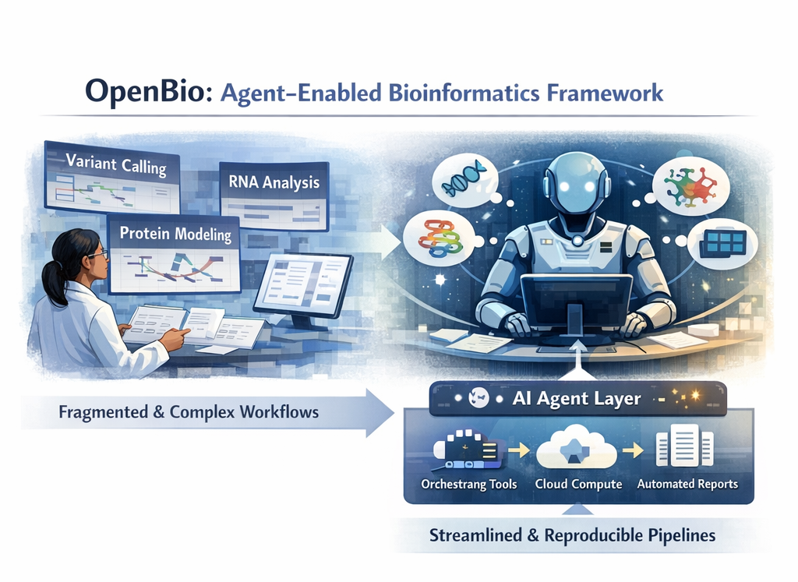
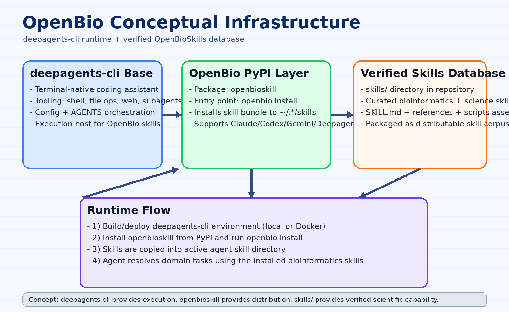

# OpenBio CLI

[](LICENSE.md)
[](#whats-included)
[](#whats-included)
[](https://agentskills.io/)
[](#getting-started)
[](https://pypi.org/project/openbioskill/)


OpenBio is a bioinformatics-focused skill distribution project built on top of [`deepagents-cli`](https://github.com/langchain-ai/deepagents). Recommend use docker image to use directly.

The default model is:

1. Use [`deepagents-cli`](https://github.com/langchain-ai/deepagents) as the execution/runtime layer.
2. Ship verified OpenBioSkills as a PyPI package (`openbioskill`).
3. Install those skills into agent skill directories with `openbio install`.

## Architecture

- [`deepagents-cli`](https://github.com/langchain-ai/deepagents): terminal agent runtime, tools, and orchestration.
- `openbioskill` (PyPI): packaging and installer for OpenBio skill bundles.
- `skills/`: verified bioinformatics and scientific skill database (`SKILL.md`, references, scripts, assets).

The conceptual infrastructure is shown in `infra.png`.

## Project Structure

```text
OpenBio/
├── openbioskill/                # Python package (CLI + installer)
│   ├── cli.py                   # `openbio` command entry
│   └── installer.py             # skill installation logic
├── skills/                      # verified OpenBioSkills database
│   └── <skill-name>/
│       ├── SKILL.md
│       ├── references/
│       ├── scripts/
│       └── assets/
├── cli_cp/deepagents_cli/       # deepagents-cli custom overlay
├── scripts/
│   ├── start_services.sh
│   └── Run_Docker.sh
├── Dockerfile                   # deepagents-based container build
├── pyproject.toml               # package metadata + entry points
├── Run_Upload_pypi.sh           # publish script for PyPI
└── infra.png                    # conceptual platform diagram
```

## Default Build: [deepagents-cli](https://github.com/langchain-ai/deepagents) + Verified OpenBioSkills (PyPI)

### 1) Runtime layer ([deepagents-cli](https://github.com/langchain-ai/deepagents))

This repository extends the deepagents runtime:
- Base install in Docker: `deepagents` + [`deepagents-cli`](https://github.com/langchain-ai/deepagents)
- Optional local runtime if you already use deepagents-compatible agents

### 2) Distribution layer (PyPI package)

`openbioskill` packages the verified skill corpus and exposes:

```bash
openbio install
```

Install behavior:
- Auto-detects and installs to one of:
  - `~/.cursor/skills`
  - `~/.claude/skills`
  - `~/.codex/skills`
  - `~/.gemini/skills`
  - `~/.deepagents/skills`
- Supports explicit target selection:

```bash
openbio install --model-name deepagents-cli
openbio install --model-name codex
openbio install --target-dir /custom/path/skills
```

## Quick Start

### Install from PyPI

```bash
python3 -m pip install openbioskill
openbio install
```

### Run with Docker (deepagents-based)

```bash
docker compose run --rm --service-ports --build flask-app
```

## Build and Publish Package

Build distributions:

```bash
python3 -m build --no-isolation
```

Upload to PyPI:

```bash
./Run_Upload_pypi.sh
```

`Run_Upload_pypi.sh` expects `TWINE_PASSWORD` (typically in `.env`) and uploads `dist/*` via `uvx twine`.

## License

MIT (see `LICENSE`).
